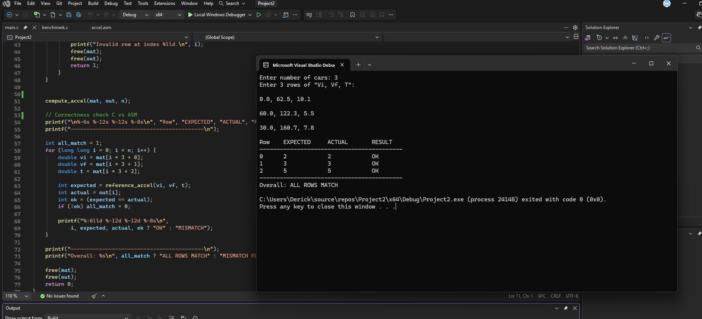
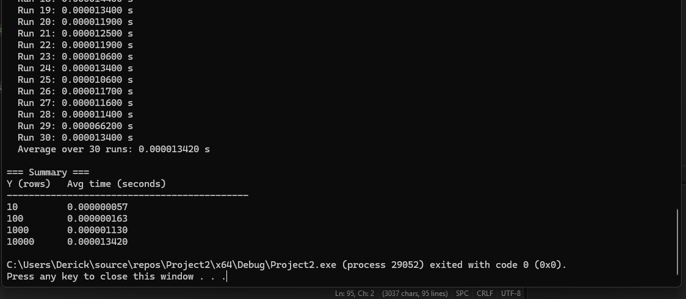

# MP DEMO LINK
## [Link](https://drive.google.com/file/d/15ScPpJpDqsKCVxIoqird-jSM-gXiAOrj/view?usp=sharing)

# Car Acceleration Calculator — C + x86-64 Assembly (NASM)

**Submitted by:** Frederick Voltair R. Garcia Jr.

Computes vehicle acceleration (m/s²) from a Y×3 matrix of `[Initial Velocity (km/h), Final Velocity (km/h), Time (s)]` per car. C handles input, memory, and output; the numeric computation is done in x86-64 assembly using **scalar SSE2 floating-point instructions**.

## Formula

```
Acceleration (m/s²) = ((Vf - Vi) * (1000/3600)) / T
```

Result is rounded to the nearest integer (`cvtsd2si`, round-to-nearest-even) before being written back to C.

## Project structure

| File | Responsibility |
|---|---|
| `main.c` | Reads input (`scanf`), allocates memory (`malloc`), calls the asm function, prints results, runs a correctness check against an independent C reference calculation, and — for the benchmark — generates random test data for Y = 10 / 100 / 1000 / 10000, times 30 individual calls to the asm function per size, and prints per-run timings and averages. |
| `accel.asm` | `compute_accel` — the only function that touches the actual math: km/h→m/s conversion, acceleration calculation, and double→int conversion. No I/O, no memory allocation. |

## Division of responsibility (per assignment spec)

- **C** (`main.c`): collects input, allocates memory for the input matrix and output array, prints results, generates random benchmark data, times the asm calls.
- **Assembly** (`accel.asm`): converts km/h to m/s, computes acceleration, converts the double result to an integer. Uses `movsd`, `subsd`, `mulsd`, `divsd` (scalar SSE2 double-precision instructions) and `cvtsd2si` for the double→int conversion.

## Calling convention

Windows x64 ABI. `compute_accel(const double *mat, int *out, long long n)`:

| Argument | Register |
|---|---|
| `mat` (input matrix pointer) | `rcx` |
| `out` (output array pointer) | `rdx` |
| `n` (row count) | `r8` |

The input matrix is a flat array — 3 doubles per row (`Vi, Vf, T`), row `i` starting at byte offset `i * 24`.

## Correctness check

`main.c` computes each row's expected result independently in plain C (`reference_accel`, using the same formula with standard `double` arithmetic) and compares it against the value `compute_accel` wrote into the output array. Results are printed side by side as `EXPECTED` vs `ACTUAL`.

### Sample output

```
Enter number of cars: 3
Enter 3 rows of "Vi, Vf, T":

0.0, 62.5, 10.1
60.0, 122.3, 5.5
30.0, 160.7, 7.8

Row    EXPECTED     ACTUAL       RESULT
------------------------------------------
0      2            2            OK
1      3            3            OK
2      5            5            OK
------------------------------------------
Overall: ALL ROWS MATCH
```



All rows matched across every test case tried (the assignment's sample data, negative/deceleration cases, single-row input, and a mixed batch of 5 rows) — no mismatches observed.

## Performance results

Benchmarked using `QueryPerformanceCounter` (Windows high-resolution timer). For each size, one warm-up call is made (untimed), then 30 individual calls to `compute_accel` are timed and averaged.

| Y (rows) | Avg time (seconds) |
|---|---|
| 10 | 0.000000057 |
| 100 | 0.000000163 |
| 1000 | 0.000001130 |
| 10000 | 0.000013420 |



### Short analysis

- Average execution time scales roughly linearly with Y, which is expected — `compute_accel` is a single `O(n)` loop with a fixed amount of work per row (three memory loads, three arithmetic instructions, one conversion, one store). Going from Y=10 to Y=10000 (1000×) increases average time by roughly 235×, consistent with linear growth once fixed per-call overhead is accounted for.
- At small Y (10, 100), the measured time is close to the noise floor of what any timer can resolve — even `QueryPerformanceCounter`, which is far more precise than `clock()`, is measuring durations in the tens-to-hundreds of nanoseconds range here, where OS scheduling jitter and cache state can meaningfully affect a single reading. This is exactly why the assignment requires averaging over 30 runs rather than trusting a single measurement: it smooths out that noise and gives a more representative number.
- No SIMD-width parallelism is being used (the assignment specifically calls for *scalar* SIMD instructions — one double at a time via `movsd`/`mulsd`/`divsd`, not packed/vectorized `mulpd`-style instructions), so there's no expectation of sub-linear scaling from parallel lanes; the near-linear result is the expected outcome for this instruction choice.

## Getting the project (clone or download)

**Clone with Git (recommended):**
```bash
git clone https://github.com/IbyarchMP/Project2.git
cd Project2/Project2/Project2
```
The project files (`main.c`, `accel.asm`, `Project2.vcxproj`, `Project2.sln`) live at that path — the repo has a nested `Project2/Project2` folder structure.

**Or download as ZIP:**
1. On the GitHub repo page, click **Code → Download ZIP**.
2. Extract it, then navigate into `Project2/Project2/` inside the extracted folder — that's where the actual `.sln` and source files are.

## Building

### Prerequisites
- **Visual Studio** (2019 or later) with the **Desktop development with C++** workload installed.
- **[NASM](https://www.nasm.us/)** installed and added to your system `PATH`. Verify with:
  ```bash
  nasm -v
  ```

### Option A — Visual Studio GUI
1. `cd` into `Project2/Project2/Project2` (see above), then open `Project2.sln`.
2. `main.c` contains both the correctness-check flow and the benchmark flow.
3. `accel.asm` is already configured as a **Custom Build Tool** item in the project — no setup needed when opening the existing `.sln`:
   - Command Line: `nasm -f win64 "%(FullPath)" -o "$(IntDir)%(Filename).obj"`
   - Outputs: `$(IntDir)%(Filename).obj`
4. **Build → Rebuild Solution**.
5. **Ctrl+F5** (Start Without Debugging) to run — plain F5 closes the console immediately after the program finishes, so use Ctrl+F5.

### Option B — Command line, no IDE
Open a **"Developer Command Prompt for VS"** (has `cl.exe` on `PATH`), then:
```bash
cd Project2/Project2/Project2
nasm -f win64 accel.asm -o accel.obj
cl main.c accel.obj /Fe:Project2.exe
Project2.exe
```
This assembles `accel.asm` with NASM, compiles `main.c` with MSVC, links both object files into `Project2.exe`, and runs it — all without opening Visual Studio's GUI.

## Testing

Tested with:
- The assignment's provided 3-row sample.
- Deceleration cases (Vf < Vi), to confirm correct handling of negative acceleration.
- A single-row input (Y = 1).
- A 5-row batch including a Vi = Vf case (expected acceleration = 0).
- Fractional/decimal-heavy Vi/Vf/T values (`Test1.png`).
- Near-zero acceleration from large time values, to confirm correct rounding down to 0 (`Test2.png`).
- A 10-row mixed batch covering acceleration, deceleration, and zero-difference rows together (`Test3.png`).
- Y = 10, 100, 1000, 10000 randomly generated data for the benchmark.

All cases produced `ALL ROWS MATCH` against the independent C reference calculation. See `Test1.png`, `Test2.png`, `Test3.png`, `Final_output.png`, and `Running.png` in this repo for the runtime screenshots.
